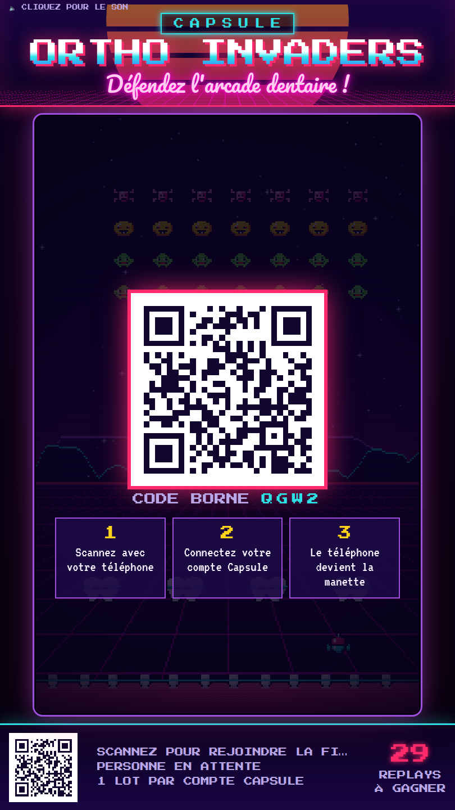
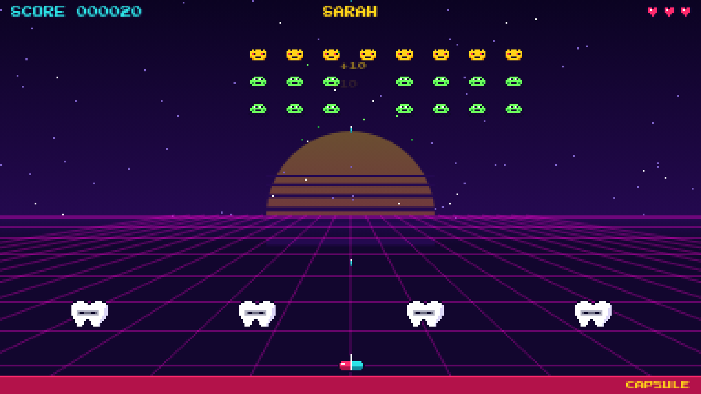
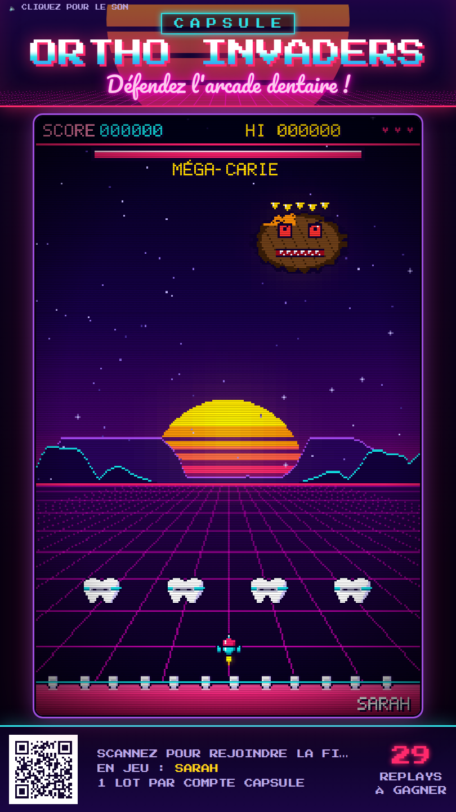
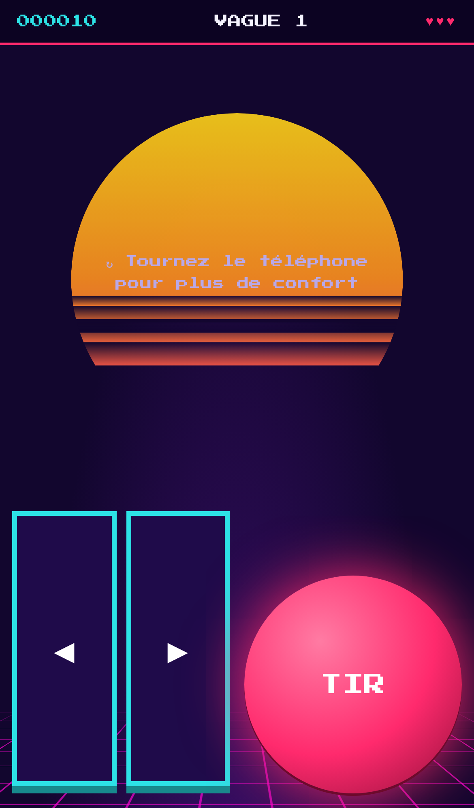
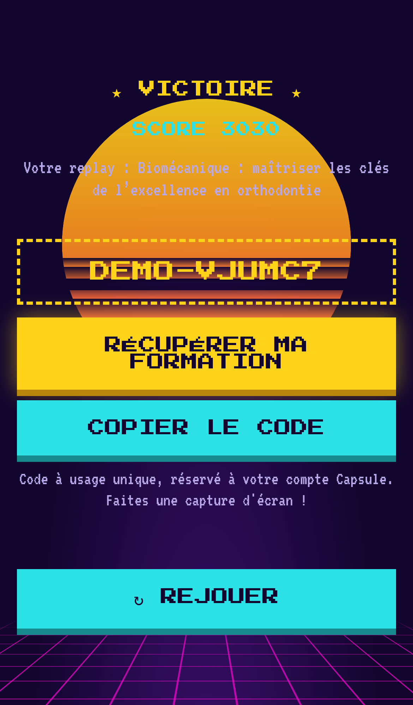

# CAPSULE · ORTHO INVADERS — borne d'arcade des portes ouvertes orthodontie

Jeu d'arcade rétro (style *Space Invaders* × synthwave) conçu pour un **grand écran**, joué avec son
**téléphone comme manette**. Le joueur se connecte avec son **compte Capsule (Shopify)** et, s'il
bat le boss, il **gagne un replay de formation**. Un code à 100 % est alors créé dans Shopify, à son nom.

```
 ┌──────────── GRAND ÉCRAN /screen ─────────────┐        ┌── TÉLÉPHONE /play ──┐
 │  QR code · file d'attente · top scores        │  scan  │ Connexion Capsule   │
 │  jeu portrait 216×336 · annonce du gagnant  │ ─────▶ │ ◀ ▶  (ou gyroscope) │
 └───────────────────────▲───────────────────────┘        │ ● TIR  · vibrations │
                         │ WebSocket (socket.io)          └─────────▲───────────┘
                         └────────────── serveur Node ──────────────┘
                                         │  API Admin Shopify
                                         ▼
                      code 100 % à usage unique sur le replay + tag client
```

## Le jeu

| | |
|---|---|
| **Pitch** | Les bactéries, la plaque et les sucres attaquent ! Pilotez la capsule, protégez les dents et abattez la **Méga-Carie**. |
| **Vaisseau** | Une capsule magenta/cyan qui tire des projectiles |
| **Boucliers** | 4 molaires avec bracket, destructibles au pixel près |
| **Ennemis** | Bactérie (10 pts) · Plaque (20 pts) · Bonbon (30 pts, 2 impacts), multipliés par le numéro de vague |
| **Bonus** | Bracket = tir triple · Élastique = tir rapide · Fluor = bouclier · Cœur = +1 vie |
| **Format** | Borne **verticale** (tablette ou totem en portrait, 9:16 ou 3:4) : fronton lumineux, écran avec effet cathodique, bandeau avec QR code permanent pour rejoindre la file |
| **Structure** | 3 vagues + boss, soit environ 2 min 30 s par partie. Entre les vagues, un encart « Le saviez-vous ? » donne une info d'hygiène orthodontique |
| **Victoire** | Vaincre la Méga-Carie avec au moins 1 vie restante. Bonus de 1 000 pts par vie restante |
| **Commandes** | Téléphone : flèches ou **inclinaison (gyroscope)** + bouton TIR, avec **vibrations** au contact. Écran : clavier (← → Espace) ou **manette Bluetooth** (Gamepad API) |

### Pourquoi WebSocket plutôt que le Bluetooth du téléphone ?

Un navigateur mobile ne peut pas se déclarer comme manette Bluetooth : Web Bluetooth fonctionne seulement
dans le sens « le téléphone se connecte à un appareil ». Le Wi-Fi ou la 4G via WebSocket donne la même
latence (environ 20 à 50 ms), sans installer d'application ni appairer quoi que ce soit : on scanne et on joue.
Le Bluetooth reste utile **côté écran** : une manette arcade ou Xbox appairée au PC de la borne fonctionne
directement, par exemple pour les démos de l'équipe.

## Lancer en local (mode démo)

```bash
npm install
cp .env.example .env      # AUTH_MODE=demo par défaut
npm start
```

- Ouvrir **http://localhost:3000/screen** sur l'écran (touche **F** pour le plein écran, **M** pour couper le son, **Entrée** pour une partie libre sans lot).
- Scanner le QR code avec un téléphone **sur le même réseau** : le QR utilise automatiquement l'IP locale.
- En mode démo, la connexion se fait avec un prénom et un email, et les codes générés sont fictifs (`DEMO-…`).

## Brancher Shopify (production)

### 1. Connexion des clients : `AUTH_MODE`

| Mode | Quand l'utiliser | Configuration |
|---|---|---|
| `customer-account` | Boutique avec les **nouveaux comptes clients** (connexion par code email) | Admin Shopify → canal **Headless** → *Customer Account API* : client **confidentiel**, URI de rappel `https://<PUBLIC_URL>/auth/callback`, origine JavaScript `https://<PUBLIC_URL>`. Renseigner `CUSTOMER_ACCOUNT_CLIENT_ID` et `CUSTOMER_ACCOUNT_CLIENT_SECRET` |
| `storefront` ✅ | **Cas de Capsule** : la boutique utilise les **comptes classiques** (email + mot de passe) ; création de compte possible depuis le téléphone | Canal Headless → jeton public Storefront API dans `STOREFRONT_ACCESS_TOKEN` |
| `demo` | Tests et répétition | Rien |

### 2. Attribution des lots (API Admin)

Créer une app (Dev Dashboard ou app personnalisée) avec les scopes `read_customers, write_customers,
read_discounts, write_discounts, read_products`, puis renseigner `SHOPIFY_ADMIN_DOMAIN` (`xxx.myshopify.com`)
et soit `SHOPIFY_ADMIN_TOKEN`, soit `SHOPIFY_APP_CLIENT_ID` + `SHOPIFY_APP_CLIENT_SECRET`.

Quand un joueur gagne et choisit son replay, le serveur :
1. vérifie qu'il n'a pas déjà gagné (fichier local **et** tag `WINNER_TAG` sur sa fiche Shopify) et qu'il reste des lots (`MAX_PRIZES`) ;
2. crée un **code de réduction de 100 %** sur le replay choisi, **à usage unique**, **réservé à ce client**, valable `REWARD_VALIDITY_DAYS` jours ;
3. ajoute les tags `arcade-ortho-2026-gagnant` et `arcade-lot-<replay>` sur la fiche client, ce qui permet la segmentation et les relances ;
4. affiche le code et un lien direct `capsule-med.com/discount/<CODE>?redirect=/products/<replay>` (réduction appliquée automatiquement).

Les lots sont configurés dans `src/config.js` :

| Lot | Formateur | Produit Shopify |
|---|---|---|
| Replay — Biomécanique : maîtriser les clés de l'excellence en orthodontie | Dr Skander Ellouze | `16510826709337` |
| Replay — Adieu les urgences : maîtriser le collage des contentions | Dr Philippides | `16510798201177` |

> ⚠️ **À vérifier dans Shopify avant l'événement**
> - Le replay **Biomécanique** est actuellement en **brouillon** : il faut le publier (ou le passer en « non répertorié ») pour que le code soit utilisable.
> - Le replay **Contentions** affiche un stock de **4** unités : désactivez le suivi de stock (produit numérique) ou montez-le au-dessus de `MAX_PRIZES`.

### 3. Sécurité et anti-triche

- L'écran s'ouvre avec `/screen?key=<SCREEN_KEY>` : seul l'écran peut déclarer une fin de partie.
- Un seul joueur contrôle le jeu à la fois (celui de la file), et le serveur ignore les entrées des autres.
- Une victoire obtenue en moins de `MIN_WIN_SECONDS` secondes est refusée.
- Un seul lot par compte (verrou local + tag Shopify), code à usage unique lié au client.
- `/screen?debug` expose `Game.debug.win()` et `Game.debug.boss()` pour la recette ; le seuil de durée reste appliqué.

## Mode téléphone-manette sur l'iPad du stand

L'iPad affiche la borne du site ; le visiteur scanne le QR code, se connecte ou s'inscrit sur son téléphone,
qui devient la manette. Relais temps réel + codes automatiques par le serveur Node de ce dépôt.
**Guide pas à pas : [docs/DEPLOIEMENT.md](docs/DEPLOIEMENT.md)** (Render via `render.yaml`).

## Version site capsule-med.com (sans serveur) — recommandée

La page `capsule-med.com/pages/ortho-invaders` (modèle `inscription-test`) **est la borne d'arcade** :
plein écran dès l'ouverture, « INSERT COIN », puis inscription ou connexion Capsule **dans l'écran de la borne**
(formulaires natifs Shopify), et le jeu démarre. Fichier du jeu : Contenu › Fichiers › `ortho-invaders-borne-v10.js`.

| Étape | Ce qui se passe |
|---|---|
| Visiteur non connecté | La borne affiche « INSERT COIN », les lots, puis « Créer mon compte et jouer » (profession demandée) ou « J'ai déjà un compte ». Liens directs : `#inscription`, `#connexion`. |
| Inscription | Compte Capsule créé par Shopify avec les tags `jeuJO`, `jeuJO-2026`, `jeuJO-inscrit` + profession. |
| Connecté | Le jeu s'affiche dans la page (clavier, ou boutons tactiles sur tablette / mobile). |
| Victoire | Le gagnant choisit son replay et confirme son email → **formulaire de contact Shopify** → email à info@capsule-med.com (compte client, score, durée, replay). |
| Une partie par personne | Après la partie : déconnexion automatique (12 s si perdu ; 2 min pour valider le gain puis 20 s si gagné). Un participant qui se reconnecte sur le même appareil voit « Partie jouée » et est déconnecté. L'équipe peut autoriser une nouvelle partie avec `?reset` dans l'adresse. Comptes de test (parties illimitées, emails marqués « COMPTE TEST ») : liste `TESTERS` (identifiants clients Shopify) dans `shopify/site-ui.js`. |
| Équipe Capsule | Crée le code dans Shopify › Réductions : 100 % sur le replay choisi, **client spécifique** = le gagnant, **1 utilisation**, puis l'envoie. L'email signale les parties anormalement courtes. |
| Stand (tablette) | Ouvrir **`capsule-med.com/pages/ortho-invaders?borne`** : plein écran (sans barre du navigateur) dès le premier toucher, lien site masqué, et retour en mode borne après « Joueur suivant » (déconnexion). Bouton « ⛶ Plein écran » disponible pour tous. |

Fichiers :
- `shopify/page-ortho-invaders.html` : contenu HTML de la page (`__GAME_URL__` = URL du fichier du jeu).
- `shopify/site-ui.js` : interface du jeu sur la page ; `tools/build-site.js` produit `shopify/ortho-invaders-site.js`
  (jeu complet en un fichier, 68 Ko), importé dans Shopify › Contenu › Fichiers et servi par `cdn.shopify.com`.
- Mettre à jour le jeu : `npm run check` (reconstruit le fichier), le pousser, le réimporter dans Fichiers,
  puis remplacer `GAME_URL` dans la page.

Limites connues : un client **déjà inscrit** qui se connecte n'est pas tagué automatiquement (pas de
serveur) ; le contrôle « un gain par compte » est fait par l'équipe à la création du code.

Segments Shopify (Clients › Segments) : **Jeu JO 2026 — Ortho Invaders (joueurs)** (`jeuJO-2026`)
et **Jeu JO 2026 — nouveaux inscrits via le jeu** (`jeuJO-inscrit`). Le tag `jeuJO` existait déjà sur
632 clients (édition 2025).

Règlement : `shopify/reglement-ortho-invaders-2026.html` (page Shopify en brouillon, 5 passages
[À COMPLÉTER]). Une fois publié, faire pointer le lien « règlement du jeu » de la page vers
`/pages/reglement-ortho-invaders-2026`. Toujours éditer ces pages en mode HTML `<>`.

La borne avec téléphone-manette et création automatique des codes (serveur Node ci-dessus, `embed.js`,
`/api/web/*`) reste disponible si vous souhaitez l'héberger plus tard.

## Déployer pour l'événement

Il faut une URL **HTTPS** : le gyroscope sur iOS et le retour OAuth l'exigent.
- **Option simple** : Render, Railway ou Fly.io (`npm start`), avec `PUBLIC_URL=https://arcade.capsule-med.com`.
- **Option salon (Wi-Fi capricieux)** : PC portable avec un routeur 4G/5G dédié et un tunnel HTTPS (Cloudflare Tunnel). Les polices sont servies en local, rien d'autre ne dépend d'un CDN.
- Écran : Chrome en mode kiosque : `chrome --kiosk --autoplay-policy=no-user-gesture-required "https://…/screen?key=…"`.

### Check-list du jour J
- [ ] Replays publiés, stock OK, code test utilisé puis supprimé
- [ ] `AUTH_MODE` réel testé avec un compte client existant **et** un nouveau compte
- [ ] Wi-Fi invité affiché à côté du QR code (ou 4G)
- [ ] Règlement du jeu affiché et accessible (jeu gratuit sans obligation d'achat, lots, 1 gain par compte, durée)
- [ ] Mention RGPD relue (prénom et score affichés à l'écran, email utilisé pour l'attribution du lot)
- [ ] Une manette Bluetooth de secours appairée à l'écran pour les démos

## Structure

```
server.js            serveur Express + socket.io (salles, file d'attente, fin de partie, lots)
src/config.js        variables d'environnement + définition des lots
src/auth.js          connexion Capsule : Customer Account API (OAuth PKCE) / Storefront / démo
src/shopify.js       API Admin : vérification du tag, création du code 100 %, tag du gagnant
src/store.js         scores et gagnants (data/*.json)
public/screen.html   borne grand écran        public/js/screen.js
public/play.html     manette téléphone        public/js/controller.js
public/js/game.js    moteur du jeu            public/js/sprites.js · audio.js (sons 8-bit WebAudio)
docs/PLAN-MARKETING.md   activation marketing de la borne
```

La charte néon se règle dans `public/css/arcade.css` (`--capsule-primary`, `--capsule-secondary`,
`--capsule-accent`) et la palette pixel art dans `public/js/sprites.js`.

## Aperçu

| Accueil de la borne | En jeu | Boss |
|---|---|---|
|  |  |  |

| Manette téléphone | Lot gagné |
|---|---|
|  |  |
